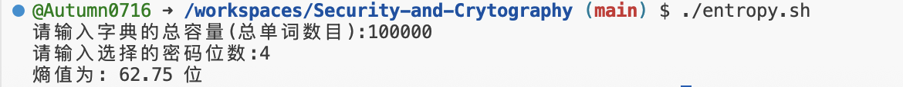
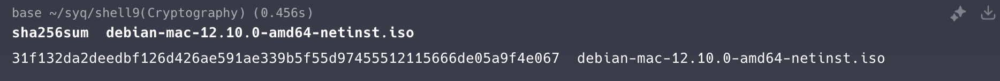
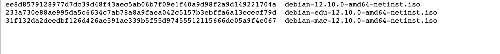

# Security-and-Cryptography
本人学习[2020 年 missing-semester](https://missing.csail.mit.edu/2020/)所做的一些作业题目,

(**这里是第九章**)
参考链接:[Security and Cryptography](https://missing.csail.mit.edu/2020/security/)

也方便自己进行查阅,时刻温习学过的知识,并且逐渐修正自己在编程 shell,python 等程序时存在的思路优化和语法错误等等.

## Exercises 

1.Entropy.  熵。
Suppose a password is chosen as a concatenation of four lower-case dictionary words, where each word is selected uniformly at random from a dictionary of size 100,000. An example of such a password is correcthorsebatterystaple. How many bits of entropy does this have?
假设选择密码作为 4 个小写字母的串联 字典单词，其中每个单词都是从 大小为 100,000 的词典。此类密码的一个示例是 correcthorsebatterystaple.这有多少位熵？
- **EX1解决办法**:
首先,这道题目本身只是对***密码学位熵***这一概念进行的考察.本身难度不高.但是由于翻译问题其实并不知道是否需要考虑 **字母大写** 的问题.故暂时不考虑        
    数学办法比较直接:100000^4,
    下面说一种SH 程序,能够在终端交互式解答该问题:
    详情关注:[entropy.sh脚本](./entropy.sh)
- 编辑 entropy.sh 文件时遇到的一些问题:
参考:[qa_entropy.md 文件](qa_entropy.md)
- 结果展示:

2.Consider an alternative scheme where a password is chosen as a sequence of 8 random alphanumeric characters (including both lower-case and upper-case letters). An example is rg8Ql34g. How many bits of entropy does this have?
考虑另一种方案，其中密码被选为 8 个随机字母数字字符的序列（包括小写字母和大写字母）。一个例子是 rg8Ql34g。这有多少位熵

- **EX2解决办法**:
这道题目换汤不换药,依然用那个熵值计算脚本来实现.
- 结果展示:

3.Cryptographic hash functions. Download a Debian image from a mirror (e.g. from this Argentinean mirror). Cross-check the hash (e.g. using the sha256sum command) with the hash retrieved from the official Debian site (e.g. this file hosted at debian.org, if you’ve downloaded the linked file from the Argentinean mirror).
加密哈希函数。 从 **mirror** （例如 ，来自这个阿根廷镜子 ）。将哈希值（例如使用 **sha256sum** 命令）与从 **Debian** 官方网站获取的哈希值（**例如此文件** ）进行交叉检查 托管在 debian.org，如果您已从 Argentinean 镜像下载了链接文件）。
资源:[镜像网站:debian](https://www.debian.org/CD/http-ftp/)
[此官方哈希值文件(网页版)](https://cdimage.debian.org/debian-cd/current/amd64/iso-cd/SHA256SUMS)

- EX3 解决办法:并不是技术活,只需要通过一个镜像网站去下载这个 ISO 文件然后,迁移到终端运行目录之后使用 **sha256sum**命令检查镜像下载的网站是非原版即可.
  原因:哈希值有唯一性.
- 结果展示:

4.Symmetric cryptography. Encrypt a file with AES encryption, using OpenSSL: openssl aes-256-cbc -salt -in {input filename} -out {output filename}. Look at the contents using cat or hexdump. Decrypt it with openssl aes-256-cbc -d -in {input filename} -out {output filename} and confirm that the contents match the original using cmp.
对称加密。 使用 AES 加密加密文件 OpenSSL：openssl aes-256-cbc -salt -in {输入文件名} -out {输出文件名}。使用 cat 或 hexdump 的使用 openssl aes-256-cbc -d -in {input filename} -out {output filename} 解密，并使用 CMP 的。
- **-EX4 解决办法:**
  先在目录里面建立一个测试文件比如`test_aes.md`,然后用以上提示过程进行操作.
  代码流程参考:[AES 加密](aescrypt.md)
  加密文件测试可以在仓库捏的 `ex4`文件夹里面看到

5.Asymmetric Crytography 内容暂时不做了.因为手头的虚拟机在学校.懒得再搞一台虚拟机了,ssh 加密所用的密钥应该比这些内容比较熟悉一点.暂时搁置